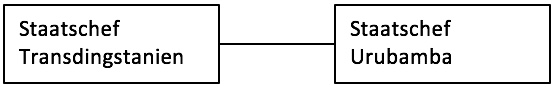
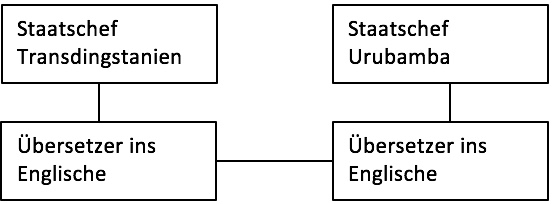

## Motivation

Die Arbeit des OSI-Schichtenmodells kann man sich folgendermaßen vorstellen:

Die Staatsoberhäupter von zwei Staaten möchten miteinander reden, sie sprechen allerdings leider nicht dieselbe Sprache. Der Staatschef von Transdingstanien spricht nur transdingstanisch, der andere Staatschef spricht nur seine eigene Landessprache urubambisch. Eine Kommunikation ist also nicht möglich.

:::{figure-md} markdown-fig


Kommunikation der Staatsoberhäupter
:::

```{admonition} Frage
Wie kommunizieren die Staarschefs miteinander?
```

```{admonition} Antwort
Die Lösung für dieses Problem ist einfach. Jeder Staatschef holt sich einen Übersetzer. Dabei ist es egal, welche Sprache die Übersetzer sprechen. Es muss lediglich jeder die Landessprache seines Staatschefs beherrschen und beide müssen eine gemeinsame Fremdsprache sprechen.
```

Nehmen wir an, die gemeinsame Fremdsprache ist Englisch. Der Staatschef von Transdingstanien spricht in seiner Muttersprache, sein Übersetzer übersetzt es ins Englische. Der Übersetzer von Urubamba versteht Englisch und übersetzt ins Urubambische. Dieses Verfahren funktioniert natürlich in beide Richtungen und die Staatschefs können über den Umweg der Übersetzer miteinander reden.

:::{figure-md} markdown-fig


Kommunikation der Staatsoberhäupter mit Hilfe der Übersetzer
:::

```{admonition} Frage
Interessiert es die Staatschefs, in welcher Sprache die Übersetzer miteinander reden?
```

```{admonition} Antwort
Natürlich nicht, denn die Kommunikationssprache ist völlig unabhängig von ihnen. Wichtig ist, dass die beiden Übersetzer dieselbe Sprache sprechen (es könnte auch problemlos Chinesisch, Schwäbisch oder einen andere Sprache sein).
```
