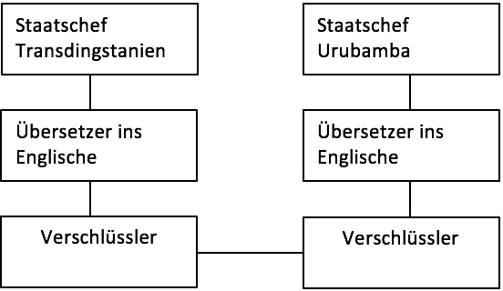

## Motivation

Die Arbeit des OSI-Schichtenmodells kann man sich folgendermaßen vorstellen:

Die Staatsoberhäupter von zwei Staaten möchten miteinander reden, sie sprechen allerdings leider nicht dieselbe Sprache. Der Staatschef von Transdingstanien spricht nur transdingstanisch, der andere Staatschef spricht nur seine eigene Landessprache urubambisch. Eine Kommunikation ist also nicht möglich.

:::{figure-md} markdown-fig


Kommunikation der Staatsoberhäupter
:::

```{admonition} Frage
Wie kommunizieren die Staarschefs miteinander?
```

```{admonition} Antwort
Die Lösung für dieses Problem ist einfach. Jeder Staatschef holt sich einen Übersetzer. Dabei ist es egal, welche Sprache die Übersetzer sprechen. Es muss lediglich jeder die Landessprache seines Staatschefs beherrschen und beide müssen eine gemeinsame Fremdsprache sprechen.
```

Nehmen wir an, die gemeinsame Fremdsprache ist Englisch. Der Staatschef von Transdingstanien spricht in seiner Muttersprache, sein Übersetzer übersetzt es ins Englische. Der Übersetzer von Urubamba versteht Englisch und übersetzt ins Urubambische. Dieses Verfahren funktioniert natürlich in beide Richtungen und die Staatschefs können über den Umweg der Übersetzer miteinander reden.

:::{figure-md} markdown-fig


Kommunikation der Staatsoberhäupter mit Hilfe der Übersetzer
:::

```{admonition} Frage
Interessiert es die Staatschefs, in welcher Sprache die Übersetzer miteinander reden?
```

```{admonition} Antwort
Natürlich nicht, denn die Kommunikationssprache ist völlig unabhängig von ihnen. Wichtig ist, dass die beiden Übersetzer dieselbe Sprache sprechen (es könnte auch problemlos Chinesisch, Schwäbisch oder einen andere Sprache sein).
```

Ein Problem ist damit aber noch nicht gelöst. Jeder Geheimdienst eines Drittstaates könnte die Unterhaltung mithören, wenn ein Übersetzer vorhanden ist, der die gemeinsame Sprache versteht. 

Die Lösung ist natürlich auch hier einfach. Die Sprache muss codiert werden, ein Verschlüsselungsspezialist muss her. Die beiden Ver-/Entschlüssler müssen über einen gemeinsamen Code verfügen, der nur diesen beiden bekannt ist (dieser kann auch schon vorher abgemacht worden sein).

:::{figure-md} markdown-fig


Verschlüsselte Kommunikation der Staatsoberhäupter mit Hilfe der Übersetzer
:::

```{admonition} Frage
Interessiert es die Staatschefs, mit welchem Code verschlüsselt wird?
```

```{admonition} Antwort
Nein!
```

```{admonition} Frage
Interessiert es die Übersetzer, mit welchem Code verschlüsselt wird?
```

```{admonition} Antwort
Nein!
```

```{admonition} Frage
Interessiert es den Verschlüssler, in welcher Sprache er die Texte bekommt?
```

```{admonition} Antwort
Nein, er übersetzt jeden Buchstaben in einen anderen Code, unabhängig von der verwendeten Sprache!
```

Nun kommt hinzu, dass die beiden Staatschefs nicht an einem Tisch sitzen, sondern jeder in seinem Büro sitzt. Die Kommunikation muss also über eine große Entfernung stattfinden. Die Daten der Verschlüssler müssen in irgend einer Weise übermittelt werden. Hierzu gibt es viele Möglichkeiten, etwa Rauchzeichen, Trommelsignale, Albhorntöne, Telefon, etc. In diesem Beispiel werden die Trommelsignale gewählt.


:::{figure-md} markdown-fig


Verschlüsselte Kommunikation der Staatsoberhäupter mit Hilfe der Übersetzern in Form von Trommelsignalen
:::

```{admonition} Frage
Interessiert die Staatschefs, mit welchem Übertragungsverfahren die Nachricht übermittelt wird?
```

```{admonition} Antwort
Nein!
```

```{admonition} Frage
Interessiert die Übersetzer, mit welchem Übertragungsverfahren die Nachricht übermittelt wird?
```

```{admonition} Antwort
Nein!
```

```{admonition} Frage
Interessiert es die Übertragungsstrecke, in welcher Sprache und in welchem Code die Nachricht übertragen wird?
```

```{admonition} Antwort
Nein!
```

`````{admonition} Fazit
:class: tip
Die Kommunikation läuft über mehrere Schichten ab. Jede Schicht arbeitet unabhängig von den anderen Schichten. Jede Schicht kommuniziert scheinbar mit der Partnerschicht auf gleicher Ebene (unabhängig davon, welche Schichten darüber oder darunter vorhanden sind). Jede Schicht (mit Ausnahme der obersten und der untersten) hat eine Schnittstelle zur darüber und eine zu der darunter liegenden Schicht. Jede Schicht hat ihre ganz spezielle Aufgabe und kümmert sich nicht um die Aufgaben der anderen Schichten.
`````
